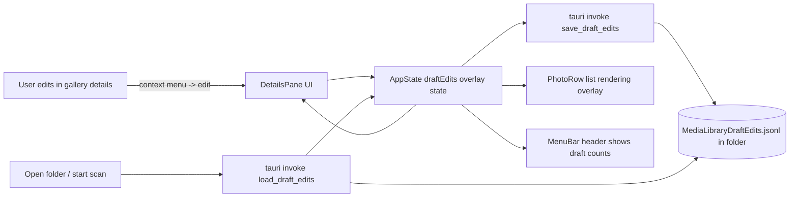

## Data flow (high level)

## Rust / Tauri: persistent JSONL per folder

- Add a JSONL reader/writer in `src-tauri/src/draft_edits.rs` (new module) used by two new `#[tauri::command]` handlers in `src-tauri/src/lib.rs`:
  - `load_draft_edits(folder_path: String) -> Result<DraftEditsPayload, String>`
  - `save_draft_edits(folder_path: String, data: DraftEditsPayload) -> Result<(), String>`
- Storage location + naming:
  - JSONL file lives in the opened folder itself:
    - filename: `MediaLibraryDraftEdits.jsonl`
    - first line is a comment describing what it stores
  - Ignore commented lines when parsing.
- JSONL line format (one edited file per line):
  - `{ "relative_path": "...", "edits": { "<propertyKey>": "<newValue>" } }`
  - For “Remove”, store `null` as value in the edits map.
- `propertyKey` matches what the UI uses:
  - list/search keys: `relative_path`, `date_modified`, `date_created`, and any image metadata key like `IFD0:Make`.

## Frontend: load drafts when opening a folder

- Extend `src/types.ts`
  - Add `DraftEditsValue = string | null`.
  - Add `DraftEditsByFile = Record<string, Record<string, DraftEditsValue>>` (outer key = `photo.relative_path`).
- Extend `src/useMediaLibrary.ts`
  - In `startScan(folder)`, before `api.invoke("start_scan", ...)`, call `api.invoke("load_draft_edits", { folderPath: folder })` and stash results into state.
  - Add `draftEdits` to `AppState.kind === "loaded"`.
  - Add new actions for edits:
    - `setDraftValue(fileRelativePath, propertyKey, newValue: string | null)` (pass `null` to remove the property)
    - `discardDraftValue(fileRelativePath, propertyKey)`
  - Each edit action:
    - updates in-memory `draftEdits`
    - immediately calls `api.invoke("save_draft_edits", { folderPath, data: updatedDraftEdits })`
    - updates React state so list + details re-render.

## Frontend: render drafts in list view

- Update `src/components/PhotoRow.tsx`
  - Add `draftEdits` prop (or derived `draftForPhoto`) and `searchQuery` integration already exists.
  - For each displayed cell (path, os columns, visible image columns):
    - if there is a draft for that `propertyKey`, render:
      - original value inside `<s>` with a subdued style
      - proposed new value after it inside `<strong>` with a draft highlight style
      - if the draft value is `null` (Remove), show `—` as the proposed value.
- Update `src/components/MenuBar.tsx` and `src/App.tsx`
  - Compute draft summary for the currently open folder:
    - `filesWithEdits`: number of files where draftEdits[file] has at least one property
    - `draftEditsCount`: total number of edited properties across those files
  - Display in the existing count area so that search formatting remains:
    - `A out of B photos, C draft edits across D files` when search is active
    - otherwise `X photos, Y draft edits across P files`

## Frontend: render drafts + editing in gallery details pane

- Update `src/components/DetailsPane.tsx`
  - Accept props needed to overlay drafts:
    - `draftEditsForPhoto` (or full `draftEdits` + `photo.relative_path`)
    - `onRequestEdit({ fileRelativePath, propertyKey, currentValue })`
  - Display overlay in both OS and image metadata tables (same strikethrough + bold new pattern).
  - Right click on a value cell (`td.details-value`) to open a context menu:
    - Options (context menu items per user choice): `Edit`, `Discard`, `Remove`
    - Right click should only be attached to value cells, not labels.
- New component: `src/components/ValueEditDialog.tsx`
  - Uses existing modal/dialog CSS (`.dialog-overlay`, `.dialog-content`, etc.)
  - Contains an input prefilled with the current displayed proposed value when editing, or the current original value when no draft exists.
  - Buttons:
    - `Save` -> calls edit action
    - `Cancel` -> closes without changes
- Update `src/components/GalleryView.tsx` and `src/App.tsx`
  - Pass draft edit overlay data + edit callbacks down to `DetailsPane`.

## Mocking + tests

- Update `src/test/mockTauriApi.ts`
  - Add handlers for new commands:
    - `load_draft_edits`
    - `save_draft_edits`
  - Persist mock data in-memory keyed by folder path so persistence tests can verify reload.
- Add integration tests (UI interaction + DOM assertions)
  - New test file: `src/test/draft-metadata-editing.test.tsx`
  - Tests to include:
    1. Gallery edit flow:
      - open folder + photo list
      - open gallery
      - show details pane
      - right click a value cell -> `Edit`
      - enter a new value -> `Save`
      - assert details table shows original struck + new bold-highlighted
    2. List overlay reflects the same draft:
      - same edit, assert the corresponding list column cell shows the same strikethrough + bold new.
    3. Draft counts in MenuBar:
      - after edit, assert header text shows the correct `draft edits across files` numbers.
    4. Persistence across folder reopen:
      - after saving a draft, close/unmount and reopen the folder (or call `openFolder` again)
      - assert the draft still renders.
  - Additional tests:
    - `Discard` removes the draft and reverts to original display
    - `Remove` shows `—` as proposed value

## Incremental commit structure (suggested)

1. `feat(tauri): draft edits JSONL load/save commands` + mock support
2. `feat(ui): render pending drafts in list + header counts` (+ unit tests/helpers if needed)
3. `feat(ui): edit from details pane (context menu + dialog)` + integration tests

## Key files to touch

- `src-tauri/src/lib.rs`
- `src/components/PhotoRow.tsx`
- `src/components/DetailsPane.tsx`
- `src/components/GalleryView.tsx`
- `src/components/MenuBar.tsx`
- `src/useMediaLibrary.ts`
- `src/types.ts`
- `src/test/mockTauriApi.ts`
- `src/test/draft-metadata-editing.test.tsx` (new)

